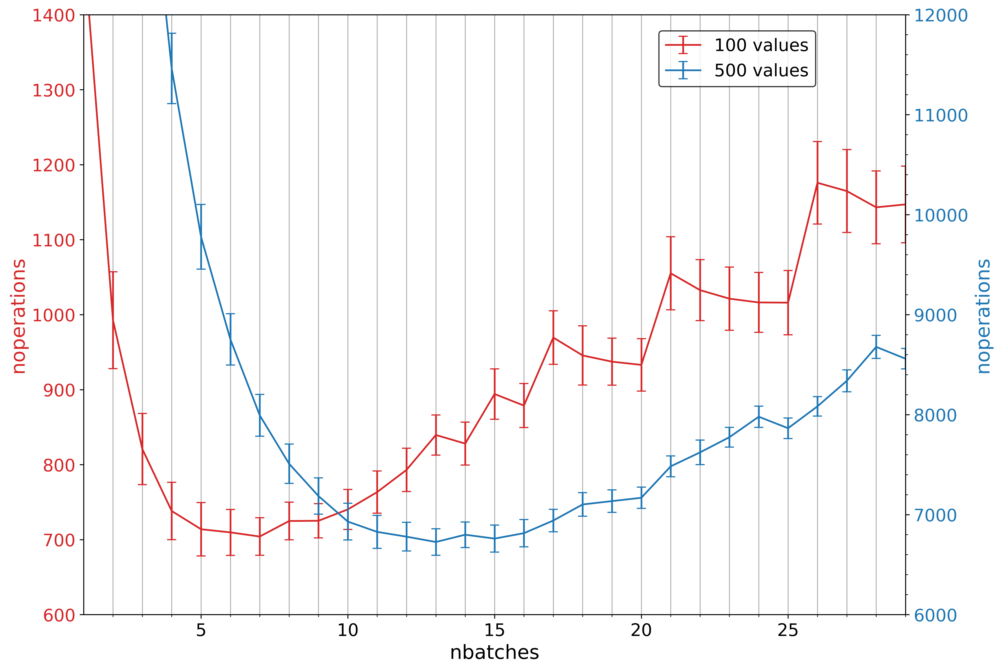
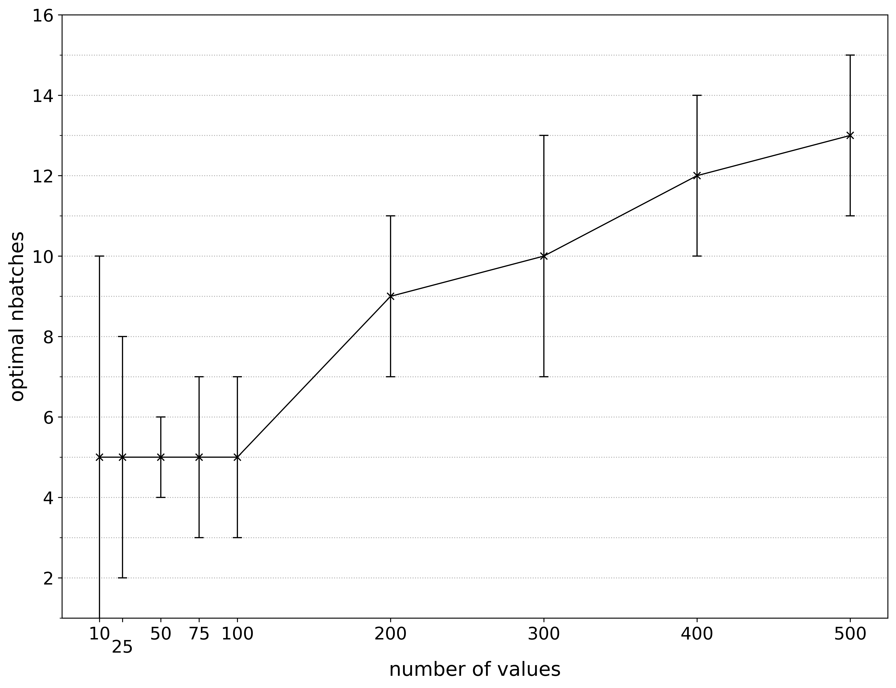

# push_swap

*This project is part of the official curriculum at [School 42](https://en.wikipedia.org/wiki/42_(school)).*

## Overview


* [Official instructions](docs/push_swap.en.pdf)
* The goal of this project is to practice sorting algorithms and design a new one, optimized for a given data structure.
* As per instructions, the project is realised using a C library compiled during [previous projects](http://github.com/almayor/libftprintfgnl).
* The project (with the exception of tests) is consistent with the [Norme](docs/norme.en.pdf), the code standard accepted at *School 42*. In particular, this means that
	* no comments inline or inside functions
	* `for` loops and `switch` statements are forbidden
	* each function must be maximum 25 lines

## Problem

The goal is to design an algorithm that would sort a list of integers without any duplicated. The algorithm should operate on two stacks, a and b, using the **shortest** sequence of the following operations:

- `sa` – Swap the first two elements at the top of stack a. Do nothing if there is only one or no elements.
- `sb` – Swap the first two elements at the top of stack b. Do nothing if there is only one or no elements.
- `ss` – Do `sa` and `sb` at the same time.
- `pa` – Take the first element at the top of b and put it at the top of a. Do
nothing if b is empty.
- `pb` – Take the first element at the top of a and put it at the top of b. Do nothing if a is empty.  
- `ra` – Shift up all elements of stackA by one. The first element becomes
the last one.
- `rb` – Shift up all elements of stack b by one. The first element becomes
the last one.
- `rr` – Do `ra` and `rb` at the same time.
- `rra` – Shift down all elements of stack a by one. The last element becomes
the first one.
- `rrb` – Shift down all elements of stack b by one. The last element becomes
the first one.
- `rrr` – Do `rra` and `rrb` at the same time.

The project yields three programs:

1. `checker`
	* Gets as an argument the stack a formatted as a list of integers (the first argument should be at the top of the stack)
	* Read instructions on the standard input, each instruction will be followed by `\n`. Once all the instructions have been read, checker will execute them on the stack received as an argument.
	* If after executing those instructions, stack a is actually sorted and b is empty, then checker must display `OK` followed by a `\n` on the standard output. In every other case, checker must display `KO` followed by a `\n` on the standard output.
	* In case of error, you must display `Error` followed by a `\n` on the standard error. Errors include for example: some arguments are not integers, some arguments are bigger than an integer, there are duplicates, an instruction don’t exist and/or is incorrectly formatted.
2. `push_swap`
	* Gets as an argument the stack a formatted as a list of integers (the first argument should be at the top of the stack)
	* The program must display the smallest list of instructions possible to sort the stack a, the smallest number being at the top.
	* In case of error, you must display `Error` followed by a `\n` on the standard error. Errors include for example: some arguments aren’t integers, some arguments are bigger than an integer, and/or there are duplicates.
3. `random_generator`
	* A simple Python script that outputs a random permutation of a given number of positive integer values

The project is then checked as follows

```sh
> ARG=$(./random_generator <number of values>); ./push_swap $ARG | ./checker $ARG
OK
```

## Algorithm

For efficiency, two different algorithms are utilized

* simple: for up to six values
* advanced: for more than six values

### Simple algorithm

1. Manually code how to sort a stack of up to three values. With only six possible permutations this is easy to do.
2. If there are over three values, push all values less than the median onto stack b, sort two stacks independently and then merge. 

### Advanced algorithm (aka Batched Insertion Sort)

1. The idea is based on a [Medium article](https://medium.com/@jamierobertdawson/push-swap-the-least-amount-of-moves-with-two-stacks-d1e76a71789a).
2. I then empirically optimized the number of batches as a function of the number of values. For example, here is the number of operations for 100 and 500 values for different number of batches (the average and standard deviation are based on 100 datapoints). As we can see, performance is best with 5 and 13 batches, respectively.

3. Following the same procedure, I computed the optimum batch number for more values


Thus, the algorithm works best with five batches for sorting lists with up to 100 values. From then on, the optimal number of batches increases roughly linearly between 100 and 500 values and can probably be extraplated in this way to higher values.

# Further directions

1. Implement A* algorithm, using Batched Insertion Sort as the heuristic.
2. Implement a variation of A* algorithm by expanding each node up to N operations ahead, then pruning the fringe (possibly by removing all by the single best node), and repeating. This doesn't guarantee optimality.
3. Implement [Iterative deepening A*](https://en.wikipedia.org/wiki/Iterative_deepening_A*)

## Acknowledgements

My sincere thanks go to [Jamie Robert Dawson](https://medium.com/@jamierobertdawson) for writing up his algorithm. I am also grateful to the entire team behind School 42 and its [Moscow branch](https://21-school.ru
), as well as to my fellow students for supports and discussions.

---
If you have any questions, please contact me on Github.
