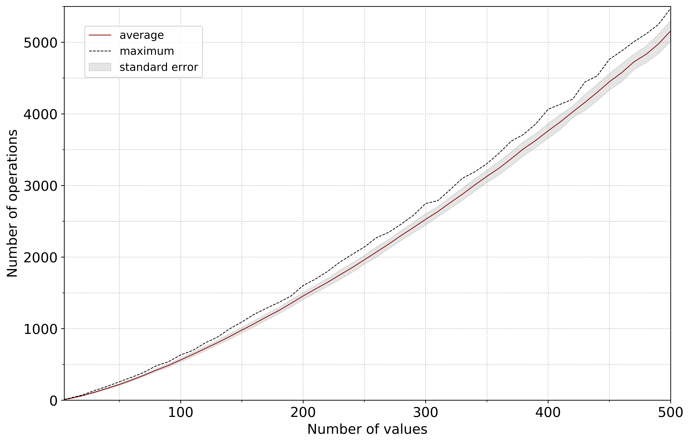

# push_swap

*This project is part of the official curriculum at [School 42](https://en.wikipedia.org/wiki/42_(school)).*

# Overview


* [Official instructions](docs/push_swap.en.pdf)
* The goal of this project is to practice sorting algorithms and design a new one, optimized for a given data structure.
* As per instructions, the project is realised using a C library compiled during [previous projects](http://github.com/almayor/libftprintfgnl).
* The project (with the exception of tests) is consistent with the [Norme](docs/norme.en.pdf), the code standard accepted at *School 42*. In particular, this means that
	* no comments inline or inside functions
	* `for` loops and `switch` statements are forbidden
	* each function must be maximum 25 lines

# Problem

The goal is to design an algorithm that would sort a list of integers without any duplicated. The algorithm should operate on two stacks, a and b, using the **shortest** sequence of the following operations:

- `sa` – Swap the first two elements at the top of stack a. Do nothing if there is only one or no elements.
- `sb` – Swap the first two elements at the top of stack b. Do nothing if there is only one or no elements.
- `ss` – Do `sa` and `sb` at the same time.
- `pa` – Take the first element at the top of b and put it at the top of a. Do
nothing if b is empty.
- `pb` – Take the first element at the top of a and put it at the top of b. Do nothing if a is empty.  
- `ra` – Shift up all elements of stackA by one. The first element becomes
the last one.
- `rb` – Shift up all elements of stack b by one. The first element becomes
the last one.
- `rr` – Do `ra` and `rb` at the same time.
- `rra` – Shift down all elements of stack a by one. The last element becomes
the first one.
- `rrb` – Shift down all elements of stack b by one. The last element becomes
the first one.
- `rrr` – Do `rra` and `rrb` at the same time.

The project yields three programs:

1. `checker`
	* Gets as an argument the stack a formatted as a list of integers (the first argument should be at the top of the stack)
	* Read instructions on the standard input, each instruction will be followed by `\n`. Once all the instructions have been read, checker will execute them on the stack received as an argument.
	* If after executing those instructions, stack a is actually sorted and b is empty, then checker must display `OK` followed by a `\n` on the standard output. In every other case, checker must display `KO` followed by a `\n` on the standard output.
	* In case of error, you must display `Error` followed by a `\n` on the standard error. Errors include for example: some arguments are not integers, some arguments are bigger than an integer, there are duplicates, an instruction don’t exist and/or is incorrectly formatted.
2. `push_swap`
	* Gets as an argument the stack a formatted as a list of integers (the first argument should be at the top of the stack)
	* The program must display the smallest list of instructions possible to sort the stack a, the smallest number being at the top.
	* In case of error, you must display `Error` followed by a `\n` on the standard error. Errors include for example: some arguments aren’t integers, some arguments are bigger than an integer, and/or there are duplicates.
3. `random-list-generator`
	* A simple Python script that outputs a random permutation of a given number of positive integer values

The project is then checked as follows

```sh
> ARG=$(./random-list-generator <number of values>); ./push_swap $ARG | ./checker $ARG
OK
```

(**NOTE** that the above command doesn't work on `zsh`, so if you're using it, run this instead `sh -c 'ARG=$(./random-list-generator <number of values>); ./push_swap $ARG | ./checker $ARG'`.)

# Algorithm

For efficiency, two different algorithms are utilized

* simple: for up to six values
* advanced: for more than six values

## Simple algorithm

1. Manually code how to sort a stack of up to three values. With only six possible permutations this is easy to do.
2. If there are over three values, push all values less than the median onto stack b, sort two stacks independently and then merge. 

## Advanced algorithm

### STEP 1: SPLIT INTO TWO STACKS

At each iteration, calculate the number of conflicts for each number left in stack a. A conflict is defined as a pair of number in the stack that are in the wrong order (i.e. the smaller number comes last). Mark the number with the most conflicts to be pushed to stack b later on and ignore it during future iterations. 

For example, in the stack

```
STACK A: 4->5->3->1->2->6
```
the number of conflicts is as follows:

```
4: 2 conflict (with 3 and 6)
5: 2 conflict (with 3 and 6)
3: 3 conflicts (with 4, 5 and 6)
1: 0 conflicts
2: 0 conflicts
6: 3 conflicts (with 3, 4 and 5)
```
Hence, we mark 3 to be pushed. Next,

```
STACK A: 4->5->3(ignored)->1->2->6
```
where

```
4: 1 conflict (with 6)
5: 1 conflict (with 6)
3: ignored
1: 0 conflicts
2: 0 conflicts
6: 2 conflicts (with 4 and 5)
```
Hence, we mark 6 to be pushed.

Once there are no conflicts left in stack a, push all the numbers destined to be pushed to stack b (so far we haven't pushed them, just kept in memory). After we're done, stack a should already be "circularly" sorted, albeit missing some numbers which are not in stack b. Moreover, we have reached this step by pushing the *fewest* numbers to stack b.

### STEP 2: MERGE STACKS

At each iteration, calculate the number of operations necessary to push a number from stack b to stack a, such that it ends up in the right place on stack a (without introducing any conflicts). Take into account that `ra` and `rb` can be accomplished simultaneously with `rr` etc. Do this for all numbers in stack b, select the one with the least number of operations and push back to stack a.

Carrying on with the example above, we have

```
STACK A: 4->5->1->2
STACK B: 6->3
```
and

```
6: 2 rotations (2 x ra) and 1 push (1 x pa)
3: 1 rotation (1 x rb) and 1 push (1 x pa)
```

Hence, we start by pushing 3. Then

```
STACK A: 3->4->5->1->2
STACK B: 6
```
we only have 6 left in stack b, so we push it with `2 x rra` and `1 x pa`.


### STEP 3: ROTATE STACK A

At this point, stack b is empty and stack a is "circulary" sorted (i.e. it has no conflicts but the smallest number may not be on top).

For example, our stack a after steam 2 is

```
STACK A: 6->1->2->3->4->5
```
It would take `1 x ra` and `5 x rra` to get 1 to the top. Therefore, we choose perform `1 x ra` and we're done.

# Results

Here is a graph describing the performance of this algorithm in the range between 1 and 500 values. Each data point consists of 100 measurements.



And here's another one, for the range between 1 and 100 values. Each data point consists of 500 measurements.


# Build and test

To build executables, run

```sh
git clone git@github.com:almayor/push_swap.git
cd push_swap
git submodule update --init --recursive
make
```

To run tests (unit and functional), run

```sh
make test
```

or, if you wish to skip unit tests,

```sh
make test TEST-UNIT=0
```

# Acknowledgements

My thanks go to `@jmalik` at the [Moscow branch](https://21-school.ru
) of School 42, discussions with whom have greatly improved my understanding of the problem and contributed to [STEP 2](###-step-2:-merge-stacks) of my algorithm. I am also grateful to the entire team behind School 42, as well as to my other fellow students for help and support.

---
If you have any questions, please contact me on Github.
